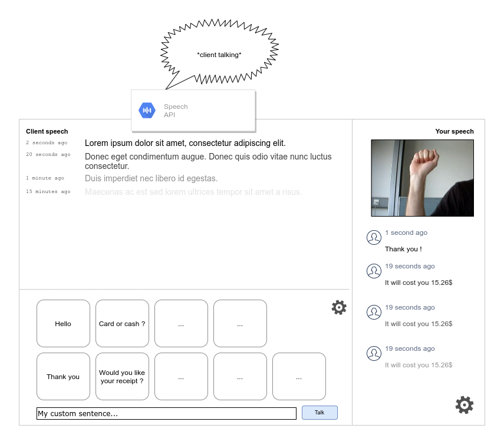

# DeafBoard

<center>
    
</center>
<br/>
DeafBoard is a simple UI designed to facilitate the professional integration of deaf and/or dumb people for jobs such as cashier or waiter.

It was designed for the [ETNA's InnovCamp 2021](https://etna.io), an innovation and tech4good-oriented hackathon, which goal is to pitch a project in **3 days** of work.



## Usage

Run the platform with Docker by executing :

```bash
docker-compose up
```
